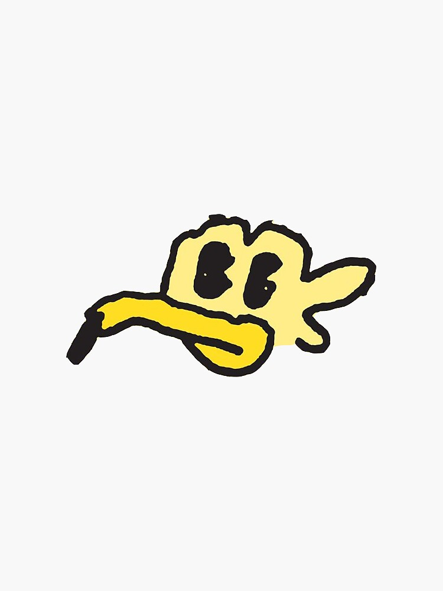
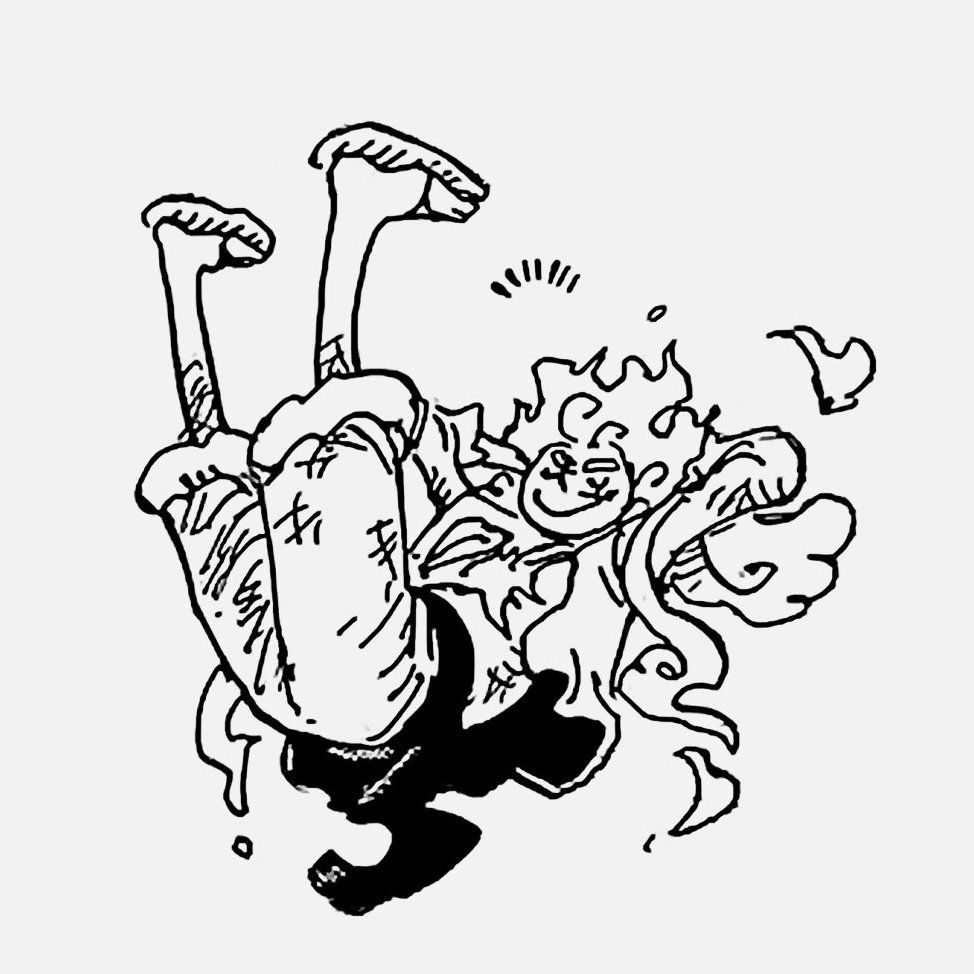

# VivreCard Design Book

> Un proyecto personal que busca preservar un recuerdo a través de una pieza diseñada y construida por mí.

---

## Estado

En desarrollo

---

# 1. El origen

Todo comenzó cuando empezó a interesarme la electrónica. Me gusta mucho hacer circuitos con muchos componentes o que no usen Arduino, como circuitos lógicos. Me empezó a fascinar cómo los electrones podían hacer muchas cosas. Antes de pensar en crear una VivreCard, estaba aprendiendo a construir circuitos sencillos. Uno de los primeros proyectos que realmente me marcó fue una compuerta lógica XOR hecha con transistores sobre una placa perforada. La compuerta XOR es mi compuerta favorita desde que empecé a diseñar un sumador-restador con compuertas lógicas.

Antes de eso, todos mis circuitos los armaba en protoboard y, con el paso del tiempo, luego de mirar y sentir que lo había hecho bien, los desarmaba para hacer otros o simplemente los guardaba para siempre. Aquella placa, llena de agujeros donde se conectaban los componentes, representó mi primer acercamiento a la construcción de una PCB. Fue un proceso difícil; se me hizo complicado unir las cosas porque era mi primera vez, pero cuando la terminé miré por primera vez algo que ya no dependía de un protoboard y que, aunque lo tuviera guardado, sería un recuerdo que siempre iba a servir. Me llenó de alegría en ese momento.

Aunque era un circuito simple, para mí significaba algo mucho más grande: el poder crear dispositivos desde cero.

En ese momento todavía no sabía diseñar PCB. Incluso evitaba hacerlo porque parecía complicado y pensaba que los programas para diseñarlas eran costosos o difíciles de utilizar. Siempre que miraba un video y luego explicaban cómo hacerlo en una PCB, me lo saltaba porque sentía que era inútil. Sin embargo, tenía mucha curiosidad por conocer cómo se creaban esas placas. Me salían videos de PCBs muy bonitas y poco a poco me fue gustando cómo se veían. Fue entonces cuando descubrí Proteus.

---

## El descubrimiento de las PCBs

Proteus fue un punto importante en mi aprendizaje. Cuando lo descargué sentí que había avanzado mucho, no por las PCBs, sino porque ahora podía simular y ver antes de hacer. Al comenzar a simular circuitos, descubrí que también podía crear mis propias placas de circuito impreso. Esto despertó en mí una nueva etapa de curiosidad. Comencé a investigar, ver tutoriales y aprender poco a poco cómo funcionaba el diseño de PCB. Me enganché mucho y pasaba horas haciendo componentes, sacando medidas y todo.

Mi primer diseño fue justamente aquella compuerta XOR con transistores que había construido anteriormente. Como ya la había diseñado en protoboard y en una placa perforada, quise que el siguiente paso simbólico fuera una PCB, para sentir que estaba evolucionando. Decidí convertirla en una pequeña PCB con forma de llavero para no solo guardarla en una caja, ya que tenía hecha, y por eso le agregué serigrafía representativa mía, como mi flor, Orión y mi firma.

Algo que debo admitir es que técnicamente solo copié el circuito y acomodé todos los componentes para que se viera bien, ya que utilicé el ruteo automático porque todavía no sabía cómo rutear las conexiones. Aun así, sentí mucha satisfacción al ver mi primera PCB creada, con mi diseño y como yo quería.

Cuando la terminé por completo, sentí algo diferente: ya no era solamente un circuito funcionando, sino un objeto que yo había imaginado, diseñado y creado desde cero. Entonces comencé a ver muchas posibilidades e ideas sobre lo que podía hacer al tener una PCB. Empecé a imaginar muchas cosas, desde proyectos comunes como fuentes de voltaje, hasta dar un regalo usando la PCB como medio para mostrar lo nuevo que había aprendido.

---

## Nacimiento de la VivreCard

Desde hace tiempo tengo la costumbre de crear regalos hechos por mí. En diferentes momentos he realizado detalles como origamis para amigos o acuarelas para personas importantes. Los origamis los doy en fechas que creo importantes o en cumpleaños; las acuarelas, solo en cumpleaños. Me gusta dar regalos que me toman tiempo de hacer, porque mientras los hago estoy pensando en dicha persona y, sin lugar a duda, eso genera un gran valor sentimental para mí, porque no hay nada más valioso que decidir darle un espacio de mi tiempo a esa persona.

Siempre me ha gustado que un regalo tenga una parte de quien lo crea. Después de diseñar mi primera PCB surgió una pregunta: ¿Y si pudiera crear un regalo electrónico completamente personalizado? Así nació el primer concepto de la VivreCard. Tenía muchas ideas, pero tenía un diseño en mente y todavía no le daba identidad ni había creado el nombre.

---

## Primer diseño

La primera VivreCard fue creada pensando en mi mamá. Quería que fuera ella quien se llevara mi primer diseño, puesto que gracias a ella tengo todo y, técnicamente, gracias a ella pude conocer el mundo de la electrónica al entrar a una preparatoria que impartía dicha carrera.

En ese tiempo había visto muchos videos de proyectos electrónicos con corazones formados por LEDs parpadeantes y letras iluminadas. Se me hicieron muy bonitos, pero todos eran hechos a mano, con cables y soldadura, lo que no permitía que se vieran completamente bien o que fueran algo feos, así que tomé esa idea como inspiración.

El diseño inicial era mucho más sencillo que el actual. Consistía en una sola PCB alimentada mediante un puerto USB tipo C. No sabía cómo se iba a alimentar; una idea vaga era que solo se conectara a un cuadrito de cargador y se conectara directo a un enchufe, como la Alexa o un aromatizador. El principal desafío fue encontrar cómo alimentarla de forma adecuada.

La tarjeta tenía dos circuitos: uno para controlar los LEDs que formaban una letra y otro para controlar unos LEDs que realizaban un patrón definido. Ambos circuitos se encontraban en la misma PCB, lo que terminaba saturando la placa.

Aunque la idea era entregársela a mi mamá por su cumpleaños, todavía faltaba mucho tiempo para esa fecha. Mientras tanto, surgió la oportunidad de regalarle la primera versión a una persona cercana. Esa fue la primera VivreCard que regalé.

Después de ver varias formas, simplemente decidí hacer una base diseñada en 3D que sostenía la placa y permitía alimentarla. Iba a ser algo decorativo, pero me apresuré mucho haciéndolo y, por alguna que otra procrastinación, terminé haciendo algunas cosas apurado.

Aquí fue donde decidí darle el nombre de VivreCard, basándome en mi anime favorito, One Piece. En la historia, una Vivre Card es un papel especial creado a partir de una parte de una persona, que puede utilizarse para establecer un vínculo con ella. Una característica que me pareció muy simbólica es que, si la Vivre Card se aleja de su dueño, siempre tiende a señalar hacia él. Lo relacioné mucho con la idea que yo quería para este proyecto, especialmente por algunos acontecimientos de la historia de One Piece, y creí que era un buen nombre.

Aunque hoy considero que es muy diferente de lo que representa actualmente el proyecto, en ese momento era algo especial. Era mi primer intento de transformar la electrónica en un recuerdo personal.

Cuando terminé dicha VivreCard, pedí que fabricaran las PCBs en JLCPCB, y ahí fue donde me enganché por completo. Fueron las dos primeras PCBs que hice y, sin lugar a duda, sentirlas y tenerlas en mis manos se sintió muy bien. Nada se asemeja a la emoción que sentí cuando soldé todos los componentes de la VivreCard y le di voltaje: mirar que los LEDs hacían exactamente lo que yo pensaba y que iluminaban de forma hermosa me emocionó.

Pero todavía estaba lejos de ser un regalo perfecto. Tal vez nunca pueda hacer una PCB 100 % eficiente o perfecta sin cambiar completamente el diseño, pero después de regalarla me di cuenta de muchos inconvenientes que me hicieron pensar que todo lo que hice fue muy poco para lo que pude haber entregado con más tiempo. No me culpo; no tenía todo el tiempo libre y literalmente era la segunda PCB que hacía, pero decidí mejorarla completamente para darle una mejor versión a mi mamá y a mis demás amigos, algo más independiente.

---

## La evolución hacia dos placas

El cambio más importante llegó cuando descubrí un proyecto de reloj de arena electrónico construido con dos PCBs conectadas mediante headers macho y hembra. Me llamó mucho la atención; parecía algo increíble. Esa idea cambió por completo la dirección del proyecto, ya que me di cuenta de que separar la VivreCard en dos partes podía solucionar muchos de los problemas del diseño original.

Al dividirla, ya no necesitaba una base externa para sostenerla y podía convertirla en un objeto independiente. Así nació la idea de separar la VivreCard en dos piezas que, al unirse, formarían un solo recuerdo:

 - PCB A.
 - VivreCore (PCB B).

---

## Nacimiento de VivreCore

Con la división del proyecto comenzó una etapa mucho más avanzada. En un principio no sabía qué iba a poner en la segunda PCB. Se me hacía muy costoso hacer dos PCBs distintas para cada persona y no lo miré para nada eficiente. Entonces decidí poner el circuito de control de la inicial como algo que todas iban a tener, pero aún sobraba mucho espacio.

Ahí fue cuando descubrí las baterías LiPo, los módulos de carga, como el TP4056, y los elevadores de voltaje, al buscar nuevas formas de alimentar mis proyectos, ya que todas las ideas que tenía usaban un conector USB y dependían de un cargador. Esto permitió que la VivreCard dejara de depender de una conexión externa y pudiera funcionar por sí misma.

La VivreCore, como decidí llamar a esa PCB, se convirtió en el corazón del proyecto. Su función principal sería controlar la alimentación y generar los efectos electrónicos que dan vida a la tarjeta y, poco a poco, se fue transformando en algo que me representaba, al diseñarla y agregarle cosas que todos saben que me gustan o me representan.

Mientras que la PCB A representaría principalmente la parte visual y personalizada para la persona que recibe la VivreCard, la VivreCore representaría mi propia identidad dentro del proyecto.

---

## Diseño y construcción

Durante todo el desarrollo, cada parte de la VivreCore fue planeada y documentada en una libreta. No solo se diseñó el circuito, sino también la distribución física, las dimensiones, la posición de los componentes y la estética general.

Me gusta pensar que si en un futuro miro dicho diseño, podré decir que no solo puse los componentes o la serigrafía donde mejor se miraba, como antes lo hacía, sino que cada componente, cada pad o cada línea fue planeada en dicha posición y tamaño desde antes de que abriera un programa. Me hace sentir que tengo dominio completo de mi proyecto y que lo conozco perfectamente.

Cada dibujo fue realizado considerando medidas reales y probado mediante circuitos armados en protoboard antes de llevarlo al diseño digital. El proyecto comenzó en Proteus, pero durante su desarrollo decidí cambiar a KiCad para aprender a utilizar una nueva herramienta y mejorar mis habilidades de diseño electrónico.

Gracias a KiCad, aprendí a rutear las conexiones, por lo que ya no solo acomodé los componentes, sino que realicé todo el diseño por completo. Ahora, aunque todavía estoy aprendiendo cosas, puedo decir que el diseño en PCB que he realizado hasta ahora ha sido el más pensado, desarrollado y complejo que he hecho. No porque use muchas conexiones o demasiados componentes, sino porque he hecho lo posible para hacerlo lo mejor que se pueda.

---

# 2. Filosofía

## ¿Qué es una VivreCard?

Una VivreCard es un regalo simbólico que refleja mis sentimientos, aprecio, cariño y el valor que le tengo a una persona, amigo o alguien cercano a mí. Más que un simple regalo como un peluche, una cadena, un libro o cualquier otra cosa que se pueda comprar, es un objeto diseñado completamente por mí, personalizado para esa persona y creado para representar el vínculo que existe entre nosotros.

Una VivreCard es un recuerdo que expresa dicho vínculo; algo que, incluso si el tiempo o la vida nos alejan, pueda hacerle recordar que alguna vez hubo algo entre nosotros. No se trata únicamente del amor que existe en una relación de pareja: también puede representar una amistad, una relación familiar o cualquier otro vínculo que tenga un significado importante.

Lo que diferencia a una VivreCard de una PCB común es precisamente su valor emocional. Su propósito no es solamente observar el circuito que genera la señal para que los LEDs se enciendan, sino poder ver el tiempo que invertí en ella, todo lo que aprendí para construirla y, sobre todo, lo que hice pensando en esa persona.

---

## ¿Por qué existe?

La VivreCard existe para dejarle claro a esa persona el papel que tiene o tuvo en mi vida. Para decirle que no es simplemente un conocido, sino alguien cercano; alguien que me acompañó, que me apoyó y que compartió momentos conmigo. Incluso si existen diferencias entre nosotros, eso no borra las experiencias buenas que vivimos.

Quiero que pueda funcionar como una especie de recuerdo de lo que fuimos. Así como una estatua puede permanecer durante siglos y permitir que otras personas recuerden que alguien existió y que algo ocurrió, me gustaría que una VivreCard pudiera conservar una pequeña parte de un vínculo incluso cuando el tiempo haya pasado.

Existe para recordar, para dar y para expresar mi amor y cariño de la mejor manera que sé hacerlo.

También existe porque me gusta unir mis pasatiempos y las cosas que disfruto con las personas que aprecio. Poder tomar aquello que me gusta, aprender, diseñar y construir algo con ello para entregárselo a alguien me hace sentir bien. Es una manera de darle una parte de mí.

---

## ¿Qué significa regalar una VivreCard?

Regalar una VivreCard representa el valor que tiene para mí, en ese momento, nuestra amistad o nuestro vínculo.

Creo que una de las cosas más valiosas que se pueden dar a otra persona es el propio tiempo. Dejar algunas cosas de lado, dedicar horas a pensar en alguien y crear algo mientras tienes a esa persona en mente le da un valor que muchas veces no puede verse a simple vista.

Como dijo el zorro en El Principito:

"Solo con el corazón se puede ver claramente; lo esencial es invisible a los ojos."

Para mí, algo parecido ocurre con una VivreCard. Su verdadero valor no está únicamente en el objeto que la persona puede ver, sino en todo aquello que existe detrás de él y que nadie más puede observar directamente.

También pienso en la rosa del Principito. Hay millones de rosas, pero la suya es única porque él le dedicó tiempo, la cuidó y creó un vínculo con ella.

Con los regalos ocurre algo parecido. Tal vez una persona prefiera un libro, una cadena u otra cosa que pueda comprar y que realmente quiera. Eso no hace que ese regalo tenga menos valor simbólico; también puede expresar mucho cariño.

Pero para mí existe algo especial en entregar algo que fue pensado, diseñado y creado específicamente para una persona.

Es un regalo único para un vínculo único.

---

## ¿Qué representa VivreCore?

VivreCore es una de las dos partes de la VivreCard. El nombre surge de la idea de un núcleo o centro: una parte que concentra aquello que mantiene unido y funcionando al conjunto.

Dentro de la VivreCard, VivreCore es la parte encargada de la alimentación, su regulación y la carga de la batería. También contiene el circuito base que genera el efecto de respiración de los LEDs que formarán la inicial de la persona en la PCB A.

Desde el punto de vista técnico, es una parte fundamental del funcionamiento de la VivreCard. Sin una fuente de alimentación, un circuito no puede funcionar. Sin embargo, su importancia dentro del proyecto no se limita a lo técnico.

Filosóficamente, VivreCore me representa a mí.

En ella se encuentran muchas de las cosas que forman parte de mi identidad y de aquello que me gusta. La electrónica es el medio mediante el cual expreso todo esto. En la serigrafía está mi flor, un símbolo que me representa desde hace años y que coloco prácticamente en todo lo que hago. Para mí, si algo lleva esa flor, tiene un valor sentimental.

También está mi firma, Orión, mi constelación favorita, y referencias a mi música favorita, como Salad Days y This Old Dog de Mac DeMarco. También está presente One Piece, que es una de mis series favoritas.

Las personas cercanas a mí probablemente reconocerían muchas de estas cosas porque son parte de los temas que más disfruto hablar y compartir: Mac DeMarco, One Piece, la electrónica, las matemáticas y las estrellas.

VivreCore es idéntica para todas las personas que reciban una VivreCard. No solamente porque hacerlo así sea más sencillo o económico, sino porque para todos ellos sigo siendo la misma persona. No tengo que convertirme en alguien diferente dependiendo de quién esté frente a mí.

Esta es la parte que me representa.

También representa mi interés por aprender y mi pasión por descubrir y construir cosas que realmente me interesan. VivreCore es la primera gran parte de todo este proyecto que he diseñado y desarrollado, y será la base sobre la cual se construirá cada PCB A.

---

## ¿Qué representa la PCB A?

En proceso...

Todavía no he terminado de definir completamente qué quiero que sea la PCB A. Antes tenía una idea más concreta, pero ahora quiero desarrollarla mejor y hacerla más personal y pulida.

Por ahora, sé que esta parte representa a la persona que recibe la VivreCard.

Esto se refleja incluso físicamente: la PCB tendrá la inicial de esa persona y su forma no será exactamente igual a la de ninguna otra. Cada una tendrá un acabado diferente y los colores de los LEDs serán escogidos pensando en esa persona, sin que necesariamente lo sepa de antemano.

También cambiará el arreglo de LEDs que rodea la inicial. Estos elementos serán elegidos de forma discreta y estarán relacionados con la persona que recibirá esa VivreCard.

Todavía queda mucho por definir, pero la idea fundamental permanece: VivreCore me representa a mí y la PCB A representa a la persona que recibe la VivreCard.

---

## ¿Por qué está dividida en dos partes?

Si lo vemos desde un punto de vista más filosófico, la división tiene un significado muy claro: VivreCore me representa a mí y la PCB A representa a la otra persona.

Sin embargo, no quiero que el mensaje sea que una de las dos partes es más importante que la otra.

Técnicamente, VivreCore es necesaria para que la PCB A pueda funcionar, pero también es cierto que VivreCore, por sí sola, no puede mostrar todo su potencial. En ella solo existe una pequeña parte de aquello que finalmente será la VivreCard. La PCB A necesita a VivreCore para recibir alimentación y utilizar sus señales, pero VivreCore también necesita a la PCB A para convertirse en aquello para lo que fue diseñada.

Ambas se necesitan.

Para mí, esto representa el vínculo entre dos personas.

Una relación necesita comunicación, conexión y unión. Ninguna de las dos personas tiene que dejar de ser quien es, pero juntas pueden formar algo que no existiría de la misma manera por separado.

Por eso la VivreCard está dividida en dos partes.

No porque una sea la mitad de la otra, sino porque cada una representa a una persona y ambas se unen para formar algo que ninguna podría representar por sí sola.

---

## ¿Qué significa que cada VivreCard sea única?

Me gustaría que, si en algún momento del futuro mis amigos ven la VivreCard o se acuerdan de ella, puedan recordarme de la mejor manera posible.

No soy la mejor persona y sé que las relaciones cambian. Las personas crecen, toman caminos diferentes y algunas veces dejan de formar parte de nuestras vidas. Pero eso no significa que las experiencias que vivimos dejen de haber sido reales.

Quiero que puedan recordar las risas, los momentos y todo aquello que compartimos. Muchas de esas cosas quizá no vuelvan a repetirse de la misma manera cuando seamos adultos, porque nosotros mismos ya no seremos las mismas personas que fuimos en ese momento.

Si algún día esa VivreCard sigue funcionando y ha sido cuidada durante muchos años, me gustaría que pudiera convertirse en un recuerdo de nuestra amistad y de nuestro vínculo.

Y si algún día ya no somos amigos, o estamos muy separados, me gustaría que pudiera recordarles que el cariño que existió fue real.

Al escribir esto también me di cuenta de algo que antes me daba miedo.

Por momentos pensé que quizá una VivreCard tenía demasiado significado y que algún día no encontraría a alguien que realmente fuera digno de recibir algo así. Pero creo que nunca se pierde nada por amar, por querer o por haberle dado importancia a alguien.

Incluso si en el futuro ya no somos nada, o simplemente me convierto en un recuerdo lejano de una etapa de su vida, me gustaría que pudiera recordar lo que existió en aquel momento.

---

## ¿Qué quiero que permanezca?

Me gustaría que, si en algún momento del futuro mis amigos ven la VivreCard o se acuerdan de ella, puedan recordarme de la mejor manera posible.

No soy la mejor persona y sé que las relaciones cambian. Las personas crecen, toman caminos diferentes y algunas veces dejan de formar parte de nuestras vidas. Pero eso no significa que las experiencias que vivimos dejen de haber sido reales.

Quiero que puedan recordar las risas, los momentos y todo aquello que compartimos. Muchas de esas cosas quizá no vuelvan a repetirse de la misma manera cuando seamos adultos, porque nosotros mismos ya no seremos las mismas personas que fuimos en ese momento.

Si algún día esa VivreCard sigue funcionando y ha sido cuidada durante muchos años, me gustaría que pudiera convertirse en un recuerdo de nuestra amistad y de nuestro vínculo.

Y si algún día ya no somos amigos, o estamos muy separados, me gustaría que pudiera recordarles que el cariño que existió fue real.

Al escribir esto también me di cuenta de algo que antes me daba miedo.

Por momentos pensé que quizá una VivreCard tenía demasiado significado y que algún día no encontraría a alguien que realmente fuera digno de recibir algo así. Pero creo que nunca se pierde nada por amar, por querer o por haberle dado importancia a alguien.

Incluso si en el futuro ya no somos nada, o simplemente me convierto en un recuerdo lejano de una etapa de su vida, me gustaría que pudiera recordar lo que existió en aquel momento.

---

## ¿Qué espero que sienta quien la recibe?

Espero que sienta alegría y cariño, que se sienta valorado y que pueda ver todo lo que hice pensando en esa persona.

No puedo decidir qué sentirá alguien al recibir una VivreCard, ni puedo saber cómo la verá después de cinco, diez o veinte años.

Cada persona la recibirá de una manera diferente.

Pero si logra entender su valor sentimental y lo que representa para mí, creo que eso sería suficiente.

No necesito que la persona vea exactamente lo mismo que yo veo en ella.

Solo quiero que pueda entender que fue hecha para ella y que detrás de ella existe tiempo, esfuerzo, cariño y una parte de mí.

---

## ¿Qué no es una VivreCard?

Una VivreCard no es un objeto de venta.

No es un producto y no existe con la intención de generar dinero. Su propósito es dar.

Me gusta buscar la perfección y siempre intento entregar la mejor versión de las cosas que hago. Sé que ninguna creación es realmente perfecta y que siempre habrá detalles que podrían mejorarse, pero eso no significa que deje de intentar hacerla lo mejor posible.

Tampoco busca sustituir una carta física, un origami o cualquier otro detalle. De hecho, la VivreCard será entregada junto con una carta y un origami.

Sin embargo, tampoco considero que sea simplemente un complemento de ellos. Tiene su propia identidad.

Incluso si la VivreCard contiene un código QR que lleva a una carta, un mensaje o cualquier otro contenido, ese contenido seguirá formando parte de la propia VivreCard y de la experiencia que quiero crear alrededor de ella.

Los efectos visuales y los circuitos son importantes, pero no existen para demostrar conocimientos de electrónica ni para presumir lo que sé hacer.

Existen porque la electrónica es una de mis pasiones y porque es una de las formas en las que sé expresar y compartir una parte de mí.

Cada VivreCard será única. Ninguna será exactamente igual a otra.

Puede utilizarse como una lámpara o simplemente como un objeto que se mantiene visible y se enciende cuando la persona quiera, pero su verdadero impacto no está en la luz que produce.

Está en lo que representa.

---

# 3. Identidad

## Abbys

Mi flor se llama Abbys, como Abyss, que significa "abismo" en inglés. El nombre no tiene ningún significado simbólico por ahora; simplemente me gustó y decidí dejarle así.

No recuerdo exactamente cuándo la creé, pero fue aproximadamente a mediados de 2023. Por esos días pasaba por muchas dudas respecto a mi personalidad y a mi identidad como persona, y de ahí fue de donde surgió. En esos tiempos la llamaba "la flor de la paz", aunque era simplemente porque todavía no sabía qué significaba para mí.

Actualmente tampoco sé completamente qué representa, pero se fue convirtiendo en algo que creció conmigo.

Abbys está basada en una flor de cerezo. Al principio, en sus cinco pétalos colocaba las iniciales de quienes en ese momento eran mis amistades más cercanas y, a un lado de ellas, las emociones que sentía que me dominaban, representadas también mediante sus iniciales y no con el nombre completo.

Con el paso del tiempo, y después de literalmente ponerla en cualquier cosa que tuviera un valor para mí, decidí quitar las iniciales y las emociones y dejar únicamente la flor. Fue una especie de cierre: esta vez quería que aquello que había creado fuera solamente para mí y que no estuviera ligado a otras personas.

Con el tiempo se convirtió en un símbolo personal. Verla en mis proyectos personales me hace sentir que realmente hice algo que tiene un valor real para mí.

---

## Mi firma

Desde que empecé a diseñar cualquier cosa que hago por mi cuenta, me gusta agregarle mi firma. Es una forma de dejar claro quién fue el creador y de hacer que el proyecto sea algo personal.

También es una forma de poner mi nombre sin que sea simplemente un texto que lo muestre. Que mi firma esté presente en la PCB remarca que es un proyecto mío, algo que hice y desarrollé por mi cuenta.

---

## Orión

Algo que siempre me ha interesado es la astronomía, y la primera constelación que miraba sin saberlo era Orión. Cuando comencé a interesarme más por las estrellas pude identificar muchas otras constelaciones, pero Orión siempre me fascinó.

Es mi constelación favorita por su historia, que une a las Pléyades y a Tauro, y porque contiene estrellas que me parecen muy hermosas, como Betelgeuse y las que forman su cinturón.

Sinceramente, me gusta ponerla en mis proyectos porque mi firma termina en tres puntos y, en ocasiones, los utilizo como si fueran su cinturón. También está presente simplemente porque es algo que me gusta mucho.

Si pongo a Abbys, trato de agregar a Orión también.

---

## Mac DeMarco

Todos mis conocidos saben que mi cantante favorito es Mac DeMarco. En general, me parece una persona muy interesante y única. Sus canciones son algunas de mis favoritas, y muchas de sus letras han logrado hacerme identificar, llorar o ponerme feliz.

Desde que me hice su fan, literalmente me han gustado casi todas sus canciones. Salad Days es el álbum que contiene más canciones que me gustan, desde sus instrumentales hasta sus letras profundas y llenas de significado.

Por eso quise ponerlo en mi proyecto: para que permaneciera como parte de él y mostrara a una persona que me inspira y conmueve el corazón por su simpleza y originalidad.

---

## One Piece

One Piece es un tema muy extenso para mí. Todo de él me encanta y creo que, sin lugar a duda, mi proyecto tenía que tener al menos algo de él.

Luffy y otros personajes me conmueven y me hacen querer perseguir mis sueños. La verdad, explicar la felicidad que me genera este anime es complicado, y cuando Luffy encuentre el One Piece, se convierta en el Rey de los Piratas y finalmente se conozca lo que ocurrió durante el Siglo Vacío, sin duda entenderé todavía más por qué esta obra es tan apreciada para mí.

Quiero que todas mis versiones tengan algo que me permita recordar que One Piece siempre estuvo presente durante etapas importantes de mi vida.

El motivo por el que escogí ese nombre, además de que sentía que quedaba perfecto y era bonito, es por el concepto de las Vivre Cards dentro de One Piece: como la Vivre Card siempre apunta hacia su dueño, quiero que quien tenga una VivreCard, al verla, también me recuerde; que apunte hacia mí y lo dirija a los recuerdos que tuvo conmigo.

---

## Lo que quiero conservar

Sin lugar a duda, si en un futuro hago una nueva versión de una VivreCard, desearía que siempre conserve estos pilares: mi Abbys, mi firma, Orión y algo alusivo a One Piece y a Mac DeMarco.

---
